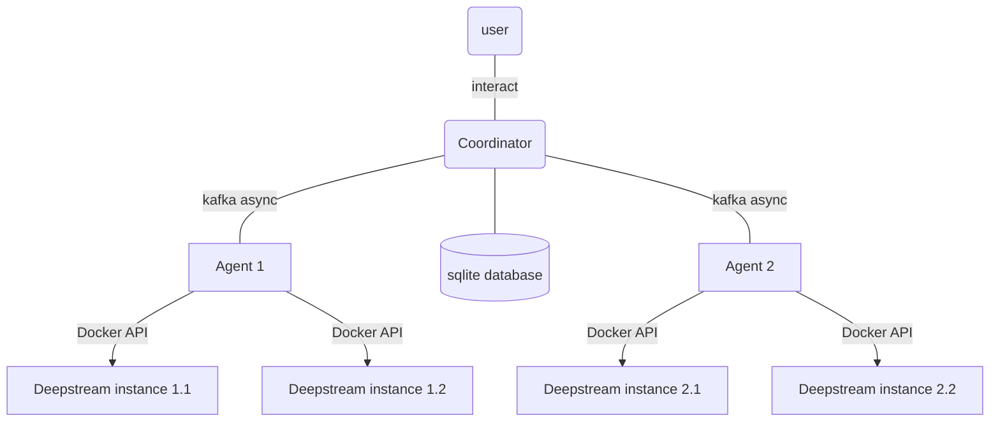
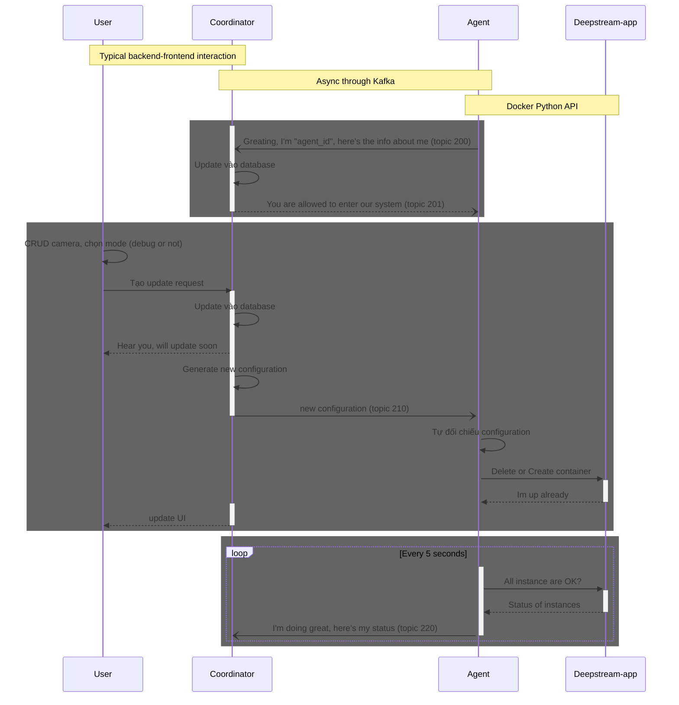
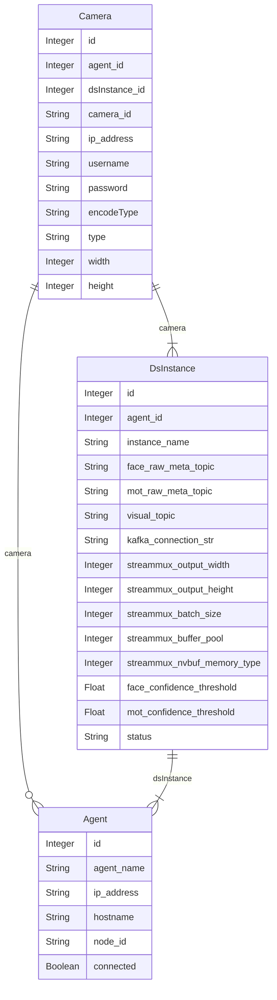

# Introduction
This repository contains code for centralized management of the activities of deepstream applications and the configurations of cameras involved. 

There are 4 main components of this system which are the coordinator, the agents, database and deepstream instance. 



- The `Deepstream instance` is a deepstream container. There are many deepstream instances running on multiple computers in a cluster. Depending on the requirements of users, the number and the configurations of those containers may change. We need a mechanism to centralized manage their activities which include start, stop, change configuration, restart and report the status of those containers. 

- `Agent` is a python program running on each computer of the cluster. `Agent`s use `python docker sdk` to manage all `Deepstream instance` instances. It can read, write instances' configuraion, up/down the containers, and monitor the containers' status.
- `Coordinator` is a centralized management program, which receives requirements from users, interacts with `Agent` **asynchronously** using `kafka`, and stores information of all cameras and deepstream instances of the system in a sqlite database. 


The work flow of the system is illustrated in the following diagram 


# Run 
## Install library and add working directory to PYTHONPATH variable

```bash
pip install -r requirements.txt
export PYTHONPATH=$PYTHONPATH:$PWD
```

## Create Kafka topics for communication among the coordinator, agents and users
```bash
cd schemas
python create_topics.py
```

This system uses 6 topics to communicate among components
- `TOPIC200` = "AgentInfo": send information from host machine to coordinator
- `TOPIC201` = "AgentCommand": send acknowledge message from the coordinator to connect to an agent and to ask the information of the agent.
- `TOPIC210` = "AgentConfig": generate new configuration for every deepstream instances based on information from database and update all containers based on the new configuration.
- `TOPIC220` = "AgentResponse": Send status of all containers to coordinator.
- `TOPIC300` = "UpdateConfig": Confirm the update configuration action from user
- `TOPIC301` = "Refresh": Users refresh connect to check which agents are connected

```mermaid
classDiagram
    DsAppConfig <|-- DsInstanceConfig
    SourcesConfig <|-- DsInstanceConfig
    MOT_pgie_config <|-- DsInstanceConfig
    FACE_pgie_config <|-- DsInstanceConfig
    MOT_sgie_config <|-- DsInstanceConfig
    FACE_sgie_config <|-- DsInstanceConfig
    FACE_align_config <|-- DsInstanceConfig
    SingleSourceConfig <|-- SourcesConfig
        class SingleSourceConfig {
        +str camera_id
        +AnyUrl address
        +EncodeType encode_type
        +str type
    } 

    class SourcesConfig {
        +List[SingleSourceConfig] sources
    } 
    PGIEConfig <|-- MOT_pgie_config
    PGIEConfig <|-- FACE_pgie_config

    class PGIEConfig {
        +PositiveInt batch_size
        +Path labelfile_path
        +PositiveInt num_detected_classes
        +Optional[str] output_blob_names
        +ClusterMode cluster_mode
        +NonNegativeInt maintain_aspect_ratio
        +PositiveInt process_mode
        +NonNegativeInt symmetric_padding
        +NetworkType network_type
        +PositiveFloat nms_iou_threshold
        +PositiveFloat pre_cluster_threshold
    } 

    class MOT_pgie_config {
        +NonNegativeInt gie_unique_id
        +PositiveInt num_detected_classes
        +str output_blob_names
        +str parse_bbox_func_name
        +ModelColorFormat model_color_format
        +PositiveFloat net_scale_factor
    } 
    class FACE_pgie_config {
        +NonNegativeInt gie_unique_id
        +PositiveInt num_detected_classes
        +ClusterMode cluster_mode
        +str parse_bbox_func_name
        +str engine_create_func_name
        +Optional[constr(regex=r"^[\d\.;]*$")] offsets
        +ModelColorFormat model_color_format
        +Optional[constr(regex=r"^[\d;]*$")] infer_dims
        +PositiveFloat nms_iou_threshold
        +PositiveFloat pre_cluster_threshold
        +PositiveFloat post_cluster_threshold
    } 
    SGIEConfig <|-- MOT_sgie_config
    SGIEConfig <|-- FACE_sgie_config
            class SGIEConfig {
        +int process_mode
        +int output_tensor_meta
        +ProcessMode process_mode
        +Optional[NetworkType] network_type
        +PositiveInt batch_size
    } 

        class MOT_sgie_config {
        +NonNegativeInt gie_unique_id
        +NonNegativeInt input_object_min_width
        +NonNegativeInt input_object_min_height
        +NonNegativeInt operate_on_gie_id
        +NonNegativeInt operate_on_class_ids
        +str output_blob_names
        +BoolEnum output_tensor_meta
        +BoolEnum force_implicit_batch_dim
        +ModelColorFormat model_color_format
        +BoolEnum classifier_async_mode
        +NonNegativeFloat classifier_threshold
        +BoolEnum maintain_aspect_ratio
        +NonNegativeInt secondary_reinfer_interval
        +PositiveFloat net_scale_factor
        +constr(regex=r"^[\d;]*$") infer_dims
        +NetworkType network_type
    } 
            class FACE_sgie_config {
        +NonNegativeInt gie_unique_id
        +NonNegativeInt output_tensor_meta
        +ClusterMode cluster_mode
    } 
            class FACE_align_config {
        +NonNegativeInt enable
        +NonNegativeInt target_unique_ids
        +constr(regex=r"^[\d;]*$") network_input_shape
        +TensorDataType tensor_data_type
        +NonNegativeInt tensor_buf_pool_size
        +NonNegativeInt input_object_min_width
        +NonNegativeInt input_object_max_width
        +NonNegativeInt input_object_min_height
        +NonNegativeInt input_object_max_height
        +str tensor_name
           } 







    class DsAppConfig {
        +DsAppType app_type
        +str face_raw_meta_topic
        +str mot_raw_meta_topic
        +str visual_topic
        +str kafka_connection_str
        +PositiveInt streammux_output_width
        +PositiveInt streammux_output_height
        +NonNegativeInt streammux_nvbuf_memory_type
        +PositiveFloat face_confidence_threshold
        +PositiveFloat mot_confidence_threshold
    } 

    class DsInstanceConfig {
        +DsAppConfig appconfig
        +SourcesConfig sourceconfig
        +MOT_pgie_config mot_pgie
        +FACE_pgie_config face_pgie
        +MOT_sgie_config mot_sgie
        +FACE_sgie_config face_sgie
        +FACE_align_config face_align
    } 

    DsInstanceConfig <|-- DsInstance
    class DsInstance {
        +str name
        +DsInstanceConfig config
    }
    DsInstance <|-- NodeInfo
    class NodeInfo {
        +str hostname
        +UUID4 node_id
        +List[DsInstance] node_config_list
    }
        class InstanceStatus {
        +str instance_name
        +str state
    }


    class TOPIC200 {
        +UUID4 node_id
        +str hostname
        +IPvAnyAddress ip_address
        +Optional[NonNegativeInt] capacity
        +Optional[List[str]] gpulist
        +Optional[str] description
    }
    NodeInfo <|-- TOPIC210

    class TOPIC210 {
        +List[NodeInfo] agent_info_list
    }
    InstanceStatus <|-- TOPIC220

    class TOPIC220 {
        +UUID4 node_id
        +List[InstanceStatus] status
    }
        class TOPIC300 {
        +str desc
    }
    class TOPIC301 {
        +str desc
    }

 
```


## Run agents
The agents will monitor the activities of container with `IMAGE_NAME` defined in file `settings.toml`. Make sure the image is already been build in each computer.
```bash
cd agent
python agent.py
```

## Run coordinator
```bash
cd coordinator
python coordinator.py
```
## Run fastAPI
```bash
cd coordinator
python app.py
```
These APIs are used to perform CRUD operations on 3 tables in sqlite database which are Camera, Agent, and DsInstance. Besides, there are 2 APIs to perform sending message to `TOPIC300` and `TOPIC301`.

**Note**: Every time a new agent is added to the database, before using the `UpdateConfig` API, the `Refresh` API must be used first to refresh connect to the new agent. This note is purely for testing the APIs. For production, the refresh action should work without a hit of a button.

# Database


