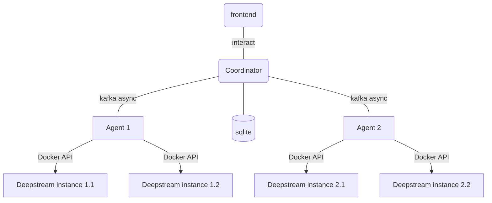
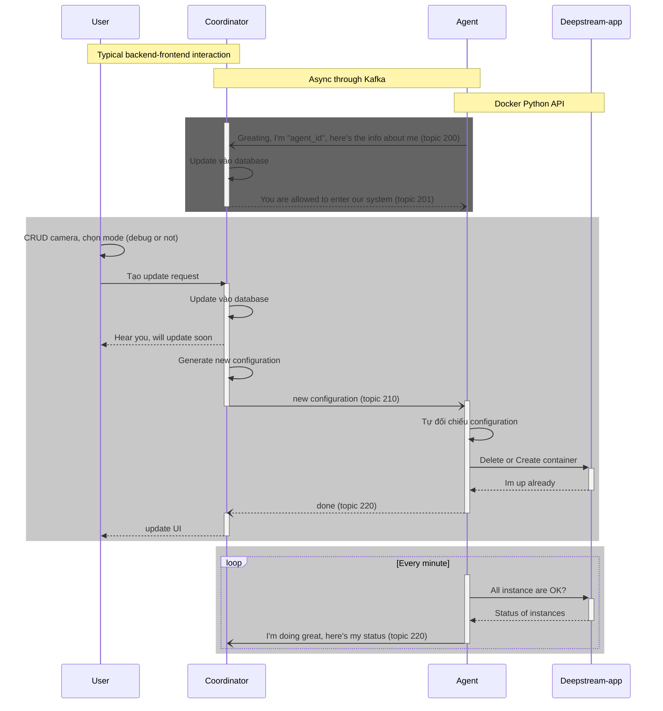

# deepstream app coordinator

NOTE: this page using `mermaid` to create graph, but `gitea` doesn't support it.
One could go to <mermaid.live> and paste the mermaid code to view diagrams.

## TODO

- [x] define config schema for deepstream-app
- [x] define topics schema
- [ ] develop agent using docker python api
- [ ] develop coordinator using what?
- [ ] how to handle deepstream-app updating?

## Design

- The `Deepstream instance` is a deepstream container, and we need to know it's configuration schema.
- `Agent`s use `python docker sdk` to manage all `Deepstream instance` instances. It can read, write instances' configuraion, up/down the containers, and monitor the containers' status.
- `Coordinator` is a fullstack app, which interact with `Agent` **asynchronously** using `kafka`

## Sequence

